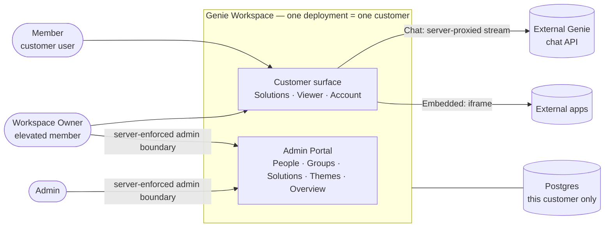

# Genie Workspace — Epic Brief

> Product / UI name is **Genie Workspace** (brand wordmark "Genie"). "Genie Control Station" and "Demo Hub" are prototype/source terms and are **not** used in production code, routes, or copy. Internal repo: `genie-ops-center`.

## Summary

Genie Workspace is the **production web application** that delivers an organization's AI **solutions** to its users and lets admins govern who can reach them. It turns the existing in-memory prototype into a real, persistent system: real sign-in, group-based access control, an admin console for managing people / groups / solutions / themes, and a customer-facing workspace where users open **live** AI solutions. Built on Next.js 16, shipped as a single configurable Docker image — **one deployment per customer**.

The work starts with the **platform foundation** (identity, access, admin, catalogue, viewer chrome) and grows progressively from there.

## Context & problem

- A complete, high-fidelity **prototype** already exists (`Genie Control Station.dc.html`), plus the **"Ledger" design system** and a reverse-engineered **FR/NFR spec**. Product and UX are well-defined as interaction reference (see _Prototype → production deltas_ for where production intentionally diverges).
- The prototype holds **all state in memory for a single session** — sign-in, codes, users, solutions and chat are demo scaffolding on sample data ("nothing here is connected to a real system").
- To be useful it needs a **persistent identity, authorization and solution store**, real sign-in, and **live** solution experiences (real chat streaming, real embedded apps).
- The proven UX delivers value only once it's backed by real identity, access governance, and live solutions — deployable into a customer's environment.

## Who & what it serves

- **Member** — customer-side user; sees only the workspace and only the solutions granted through their groups. No admin affordances.
- **Workspace Owner** — elevated member who can also reach the Admin Portal via the separate admin sign-in.
- **Admin** — manages people, access, solutions and themes from the Admin Portal.
- **External systems** — the external Genie chat streaming API (Chat), external web apps embedded via iframe (Embedded), and a Postgres holding this one customer's data.

## What we're building (high level)

**Two surfaces, kept cleanly separated** (the customer surface may be handed to a customer's users, so its copy stays neutral and leaks no admin affordances):

- **Customer surface** — _Solutions_ (access-gated catalogue), _Solution Viewer_ (Chat / Native / Embedded), and _Account & security_.
- **Admin Portal** — _People_, _Groups & Access_, _Solutions_, _Themes_ (Chat-only), and an _Access Overview_ explorer.

**Three solution types — and where the intelligence lives:**

| Type                     | Production behavior                                                                                                                                                                                         |
| ------------------------ | ----------------------------------------------------------------------------------------------------------------------------------------------------------------------------------------------------------- |
| **Chat**                 | Streams from an **external Genie chat API**, **server-side proxied** (secrets never reach the browser); ai-sdk-ui on the client. Themeable, configurable.                                                   |
| **Embedded** (Smart-API) | An **external app hosted in an iframe** by per-solution HTTPS URL. Configurable, not themeable. No SSO/token handoff in foundation.                                                                         |
| **Native**               | Built inside this repo **later**. Foundation ships the **internal enum only** — hidden from admin registration and customer catalogue filters until the first native slice. No openable/grantable path yet. |

**Access model** — access is granted to **groups only** (group → solutions, people → groups). A person's reachable solutions are the union across their groups. No per-user grants.

## Security & data invariants (non-negotiable at this stage)

- **Admin is a server-enforced privilege boundary** — every admin route and tRPC procedure checks role/capability on the server. Admin separation is _not_ just a separate screen or hidden nav.
- **External chat is server-side proxied** — the external chat API base URL and credentials live server-side only and never reach the client.
- **No tenant boundary in the schema** — one deployment serves one customer; there is no organization/workspace table. The entire People/Groups/Solutions store belongs to that single customer; isolation is at the deployment level.
- **Per-deployment configuration** — DB URL, external chat API base + token, and allowed iframe origins are deployment config, not code.

## Locked framing decisions

| Decision             | Choice                                                                                                                                       |
| -------------------- | -------------------------------------------------------------------------------------------------------------------------------------------- |
| Naming               | Product/UI = **Genie Workspace**; "Control Station" / "Demo Hub" are prototype terms, not used in production                                 |
| Positioning          | **Production delivery portal** — real solutions and data; the prototype's "sample data" framing is legacy                                    |
| Chat intelligence    | **External streaming API** (live), server-side proxied — not built in-app                                                                    |
| Embedded             | **Iframe hosting** of external apps by per-solution URL; no SSO handoff yet                                                                  |
| Native               | **In-repo but deferred** — internal enum only, hidden until first native slice                                                               |
| First build          | **Platform foundation first** (auth, access, admin, catalogue, viewer chrome)                                                                |
| Deployment / tenancy | **One deployment per customer** — single configurable Docker image + one Postgres; isolation at the deployment level, no tenant ID in schema |
| 2FA / OTP            | **Skipped for now** — email + password only (see auth delta below)                                                                           |
| Design authority     | The `design-system/` token files (**Geist / Geist Mono**) are source of truth over older spec text                                           |

## Prototype → production deltas

The FR/NFR spec is interaction reference, but production intentionally overrides it in these areas. Where they conflict, this table wins.

| Area                  | Prototype / spec                                                                    | Production (this build)                                                                                                                                                |
| --------------------- | ----------------------------------------------------------------------------------- | ---------------------------------------------------------------------------------------------------------------------------------------------------------------------- |
| Persistence           | In-memory, single session, sample data                                              | Postgres; real persistent identity/access/solution store                                                                                                               |
| Auth (FR-AUTH-01/02)  | Password → **second-factor step** → workspace/admin                                 | Password success **creates the session directly**; no second-factor step                                                                                               |
| MFA controls          | Setup/reset/disable 2FA, remembered devices, admin reset-MFA (FR-ACCT, FR-ADM-P-05) | **Not shipped** in foundation. Plain device/session management kept; remembered-device dropped (it's 2FA-tied). **Accepted security reduction; MFA is a later slice.** |
| Chat (FR-VIEW-01)     | Canned keyword replies                                                              | Real external streaming API, server-proxied                                                                                                                            |
| Embedded (FR-VIEW-04) | Simulated flaky external console                                                    | External app in iframe (per-solution HTTPS URL)                                                                                                                        |
| Native (FR-VIEW-03)   | Upload→Processing→Results wizard                                                    | Deferred; enum only, hidden from registration/catalogue                                                                                                                |
| Naming                | "Demo Hub", "Genie Control Station"                                                 | "Solutions" / "Genie Workspace"                                                                                                                                        |

## Scope

**In (foundation):**

- Real email + password authentication & session handling (idle timeout, forgot-password, devices & sessions)
- Group-based authorization (the single access mechanism), server-enforced admin boundary
- Admin console — People, Groups & Access, Solutions, Themes, Access Overview
- Customer surface — Solutions catalogue + Solution Viewer chrome (sidebar / standalone / present modes, offline awareness)
- **Chat** wired to the external streaming API (server-proxied); **Embedded** via iframe
- "Ledger" design system carried into production code

**Deferred (later slices):** Native solution apps, 2FA / MFA.

**Out of scope:** building the AI / chat model itself; building the embedded external apps; multi-tenant / multi-customer isolation within one deployment.

## Carried to the tech-plan (not decided here)

Auth & session mechanism · chat transcript persistence · whether `/admin/login` issues a distinct session or an admin-claimed one, and the Owner-vs-Admin role model · RBAC enforcement across tRPC · iframe CSP / `frame-src` / sandbox policy · Drizzle schema modeling of solutions/groups/people/themes · Docker build & per-deployment config/secrets handling.

> The external chat streaming contract is captured in the **External Genie Chat API — Observed Contract** artifact. Resolved there: it's SSE; `answer` is a delta during `processing` and the full text at `completed`; bot identity = request `uuid` (per-solution config); `sessionUUID` ownership = per conversation (server-issued). Chat content is HTML and must be sanitized.
