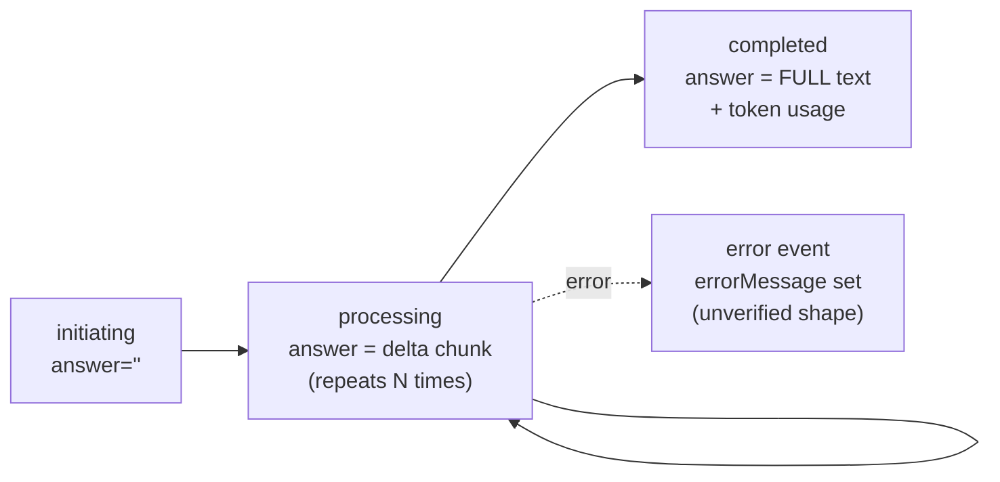

# External Genie Chat API — Observed Contract

Captured by calling `POST https://dev-genie.001.gs/public-api/v2/workflow/chatbot/chats` directly (2026-06-30). This is the **real** streaming contract the Chat solution type must bridge to ai-sdk-ui. Where this conflicts with the prototype's canned-reply behavior, **this wins**.

## Transport

- **SSE** — `content-type: text/event-stream`, Cloudflare-fronted, HTTP/2. `cache-control: no-cache`.
- Each event is a single `data: {json}\n\n` line. **No `event:` types, no `[DONE]` sentinel.**
- **Termination signal = `status: "completed"`** (or an error event — see lifecycle). Stream closes after.
- No auth header was required — it's a **public** endpoint today. (Production should still proxy server-side; see invariants.)

## Request

```json
{
  "uuid": "f48f6cbd-ef08-4d9d-a7c5-89494ba5ab68",
  "userPrompt": "…user message…",
  "sessionUUID": "",
  "language": "en-US",
  "documentIDs": [],
  "imageIDs": [],
  "audioIDs": [],
  "customFields": {}
}
```

| Field                                   | Meaning (observed)                                                                                                                                                                                                   |
| --------------------------------------- | -------------------------------------------------------------------------------------------------------------------------------------------------------------------------------------------------------------------- |
| `uuid`                                  | **The chatbot / workflow id** — _which bot_ to talk to. Stable per bot; stored in each Chat solution's config. (The tested bot is a fixed hospital-ops workflow that returns intent-driven answers, not a free LLM.) |
| `sessionUUID`                           | **The conversation id.** Empty `""` → server starts a new conversation. Pass back the returned `uuid` to continue the same conversation.                                                                             |
| `userPrompt`                            | The user's message text.                                                                                                                                                                                             |
| `language`                              | BCP-47 (`en-US`).                                                                                                                                                                                                    |
| `documentIDs` / `imageIDs` / `audioIDs` | Attachment id arrays (empty in foundation).                                                                                                                                                                          |
| `customFields`                          | Free-form object.                                                                                                                                                                                                    |

## Response event envelope

Every `data:` event has the same keys:

| Field                                             | Notes                                                                                                                                                                                                                                                             |
| ------------------------------------------------- | ----------------------------------------------------------------------------------------------------------------------------------------------------------------------------------------------------------------------------------------------------------------- |
| `uuid`                                            | **Conversation id.** Same across all events of one response; identical on the continuation call → confirms it's the session handle.                                                                                                                               |
| `requestMessageID` / `responseMessageID`          | Per-message ids.                                                                                                                                                                                                                                                  |
| `status`                                          | Lifecycle: `initiating` → `processing` → `completed`.                                                                                                                                                                                                             |
| `answer`                                          | **The streamed text** — see framing below (the load-bearing detail).                                                                                                                                                                                              |
| `reasoning`                                       | **Optional** — the bot's _thinking_, streamed separately from `answer`. Absent in many responses; when present, arrives before/alongside the answer and is echoed in full on `completed`. Maps to ai-sdk reasoning parts / the AI Elements `Reasoning` component. |
| `inputTokens` / `outputTokens` / `TokenBreakdown` | Usage; populated at `completed` (`0` earlier).                                                                                                                                                                                                                    |
| `nodeInfos`                                       | Verbose workflow execution trace (root → start → logic → … nodes, with per-node logs/timings). Not needed for chat text; could drive a "thinking/steps" indicator.                                                                                                |
| `title`                                           | Conversation title (derived from first prompt).                                                                                                                                                                                                                   |
| `intents`                                         | Intent routing object.                                                                                                                                                                                                                                            |
| `errorMessage`                                    | Empty on success.                                                                                                                                                                                                                                                 |
| `startTime` / `endTime`                           | RFC3339; `endTime` is zero-value until done.                                                                                                                                                                                                                      |

## ⚠️ `answer` framing — the load-bearing detail

- During **`processing`**, each event's `answer` is an **incremental DELTA** (the next chunk of new text only — it does _not_ repeat earlier text).
- The **`completed`** event's `answer` is the **ENTIRE final text** (the concatenation of all deltas).
- Verified: deltas of length `101 + 73 + 92 + 61 + 78 + 109 = 514` and the `completed` `answer` was exactly **514** chars.

**Mapping rule:** stream the `processing` deltas as text; on `completed`, **do not append `answer` again** — it's the full text. Treat `completed` as end-of-stream + source of token usage (and an authoritative full-text reconciliation if needed).

- `answer` contains **inline HTML** (`<strong>`, `<span style="color:#52c41a;">`, `\n`), not plain text — and a delta can split mid-tag _and mid-attribute_ (observed: one delta ends `…<span style="color: #52c41a`, the next begins `;">`). The prototype's plain-text assumption does not hold.
- **Render via Streamdown (AI Elements `Response`), not a hand-rolled HTML path.** Streamdown renders raw inline HTML by default (`rehype-raw`), sanitizes by default (`rehype-sanitize`, configurable allow/deny lists) and hardens links/images (`rehype-harden`), and is built to render _incomplete_ streaming markup gracefully — exactly the mid-tag-split case. So the XSS boundary **and** the partial-tag problem are handled by the renderer; no separate DOMPurify pass.
- **One config decision:** `rehype-sanitize`'s default schema strips inline `style`, so the bot's semantic color spans (`style="color:#52c41a"`) render as plain text. To keep the colors, extend the sanitize allow-list to permit `style` — or, cleaner for Ledger, map the spans to Ledger semantic classes via Streamdown's `allowedTags`/`components`. Decide at impl.

## `reasoning` — the "thinking" block

- It's the bot's **thinking**, rendered as a _separate_ block from `answer` (the reply shown to the user). Industry-standard pattern: a collapsible "Thinking…" disclosure that's expanded + live while the model reasons, then auto-collapses to a "Thought for Ns" summary when the answer begins, manually re-expandable. The **AI Elements `Reasoning` component** does exactly this — Ledger-styled (mono `THINKING` eyebrow, hairline, muted text).
- **Intermittent:** present in some responses (the `"dfdf"` run), absent in others (a "recommend a fix" run produced none). Don't assume it's always there.
- When present here it arrived as a **single block** in one `processing` event _before_ the `answer` stream began; `completed` repeated the full text. Whether it ever streams as multiple deltas in longer runs is **unconfirmed** — handle generically (accumulate; if a new value is a prefix-superset of the prior, treat as cumulative, else append).

## Status lifecycle



## ai-sdk-ui bridge (high level — detail belongs in tech-plan)

A Next.js route handler proxies this SSE server-side and re-emits the **ai-sdk UI message stream**: for each `data:` JSON → emit a **`text-delta`** for the `processing` `answer` and a **`reasoning`** delta for any `reasoning`; on `completed` emit `finish` (carry `outputTokens`) and **do not** re-emit the full `answer`. Server holds the bot `uuid` (from solution config) and maps the ai-sdk thread to `sessionUUID` (start empty, persist the returned conversation id for follow-ups). The client renders the answer with **AI Elements `Response` (Streamdown)** — HTML render + sanitization built in (see config note above) — and the thinking with the **AI Elements `Reasoning`** block.

## Resolved / still open

- **Resolved:** `sessionUUID` ownership = **per conversation**, server-issued, client/thread persists it. Bot identity = request `uuid`, per-solution config.
- **Open (tech-plan):** whether `reasoning` ever streams as multiple deltas (only seen as one block); the Streamdown sanitize-`style` allow-list decision (keep inline colors vs map to Ledger classes); error-event shape (couldn't trigger one); whether transcript history is persisted by us or refetchable; attachment (`documentIDs` etc.) upload path; production auth (today it's open public-api); rate limits / timeouts; how `nodeInfos` (if at all) surfaces in the UI.
