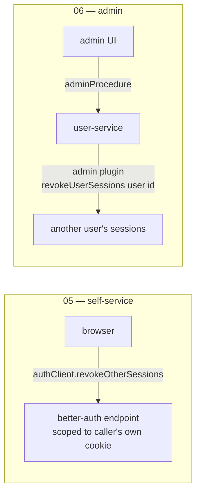
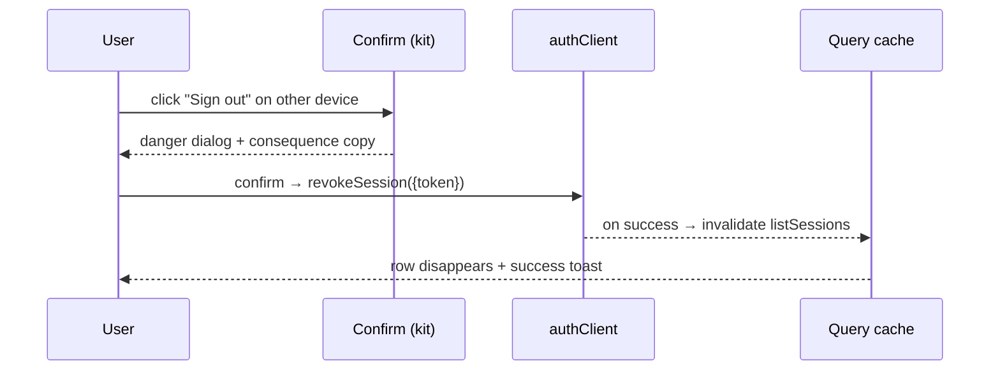

# Tech Plan — Account & Sessions

Technical approach for [05 · Account & sessions](../../tickets/05-account-sessions/index.md) (FR-ACCT). Governing decisions are settled here; implementation should not re-invent them. Builds on [tech-plan → Sessions & lifecycle](../index.md) and the [data model](../data-model/index.md) `session` table.

## Shape in one line

An almost entirely **client-side slice** on `(workspace)/account`: profile, password, and devices are all **better-auth client calls** (`authClient`) — the `authClient`-direct pattern ticket 04's auth screens already use. No schema change, no new tRPC router. The **one** server touch is a single session-config line (`freshAge: 0`, see below) — a constraint surfaced during execution, not in the original plan.

| FR | Mechanism | Reuses |
| --- | --- | --- |
| Profile display-name (ACCT-01) | `authClient.updateUser({ name })` → `useSession().refetch()` | initials derived client-side |
| Change password (ACCT-02) | `authClient.changePassword` | `passwordSchema`, `PasswordStrengthMeter` (already extracted) |
| Devices & sessions (ACCT-03) | `authClient.listSessions` / `revokeSession({ token })` / `revokeOtherSessions` | `useConfirm()` danger dialog (kit, ticket 02) |

## Major decisions

| Decision | Choice | Why |
| --- | --- | --- |
| Data path | **`authClient`-direct** (not a tRPC server seam) | better-auth's session endpoints are scoped to the caller's own cookie — inherently safe for self-service. Matches ticket 04. No premature server layer. |
| Placement | **Route-local** `(workspace)/account/_components` — not a `features/` slice | Consistent with the tech-plan's own note that `features/users/` is the first feature slice, landing at ticket 06. |
| Change-password form | **New in-place form**, reusing `passwordSchema` + `authClient.changePassword`; on success **toast + stay** | Ticket 04's `ChangePasswordForm` redirects to `/`/`/admin` (it's the forced-change destination). The account context must stay put. The genuinely shared parts are already extracted. |
| Session list state | **TanStack Query** wrapping `authClient.listSessions()`, invalidated on revoke | AGENTS.md state table: server/cache state is Query's job. |
| Email + role | **Read-only** on the profile | ACCT-01 lists only display-name as editable. Email change is out of 05's scope. |
| Session freshness | **`session.freshAge = 0`** in `auth.ts` (disable the gate) | See below. |

## Session freshness (`freshAge`) — disabled

better-auth gates a few endpoints on `now − session.createdAt < freshAge` (**default 24h**): `listSessions` and `unlinkAccount` (both via `freshSessionMiddleware`), plus `deleteUser` when called **without** a password (an inline check). Everything else uses non-fresh middleware and is **not** gated — `updateUser` (the profile rename) is on `sessionMiddleware`; `changePassword` / `changeEmail` / the revoke endpoints are on `sensitiveSessionMiddleware`. In this app, only **`listSessions`** is both used and freshness-gated (`unlinkAccount` needs OAuth we don't have; `deleteUser` isn't exposed) — so it's the sole driver.

`freshAge` is a step-up ("sudo mode") trigger designed for **long-lived sessions paired with a re-authentication flow** — you stay logged in for weeks, and a sensitive action re-prompts for your password. We have **neither**: sessions are 15-min *sliding*, so `createdAt` legitimately ages past 24h while a user stays active, and there's no re-auth flow to recover from the failure. Left on, it would (wrongly) break the **sessions list** for any continuously-active session older than 24h.

**Decision:** set `freshAge: 0`. Our security model is the 15-min idle timeout, not a login-recency window. Sensitive actions re-authenticate *explicitly* instead:

- change-password already requires `currentPassword`;
- a future **delete-admin** (or similar dangerous action) passes a `password`, which **bypasses `freshAge` entirely** (`if (!ctx.body.password && freshAge !== 0)`) — so turning the gate off does **not** block that feature. Password re-entry at the moment of the action is the stronger, freshAge-independent proof.

If true time-based step-up is ever wanted, it's a deliberate feature (a re-auth flow, and likely longer-lived sessions to make it meaningful), not this config flag.

## The ticket-06 reuse boundary (explicit)

Ticket 06's admin force-sign-out (FR-ADM-P-05) is a **different mechanism on a different surface** and does **not** share 05's revocation code:

- **05** = client-direct, acts on *your own* sessions.
- **06** = server-side, privileged, targets *another* user, routed through the single domain user-service (ticket 06's own guardrail).

The only thing 06 genuinely reuses is the **confirm-dialog idiom** (danger tone + consequence copy before a destructive session action) — already a shared primitive from ticket 02. **Do not build a shared server-side session service in 05** on the expectation that 06 extends it; 06 won't route through it.

## Devices & sessions — the detailed mechanism

The `session` row already carries everything the list needs: `token`, `ipAddress`, `userAgent`, `updatedAt`, `createdAt`.

**Current-device detection.** `authClient.useSession()` gives the active session's token; a `listSessions()` row whose `token` matches is the current device.

**Row actions (settled):**

| Row | Action | Call |
| --- | --- | --- |
| Current device | badged **"This device"**, no per-row revoke | normal `signOut()` handles it (existing) |
| Other device | per-row **"Sign out"** (confirm first) | `revokeSession({ token })` |
| — | **"Sign out all other devices"** (confirm first) | `revokeOtherSessions()` |

Rationale: revoking the session you're actively using is the odd case; the current device signs out through the normal path, and `revokeOtherSessions` keeps it alive by construction — matching the FR wording ("an individual device" / "all *other* devices").

**Presentation (normal judgment):** device label = light inline parse of `userAgent` ("Chrome on macOS"), no UA library. "Last active" = relative time from `updatedAt`. (The current session's `updatedAt` slides on every request via `updateAge: 0`, so it always reads ~now — expected.)

## Profile & password (briefer)

- **Profile:** initials avatar derived from `user.name`; email + role read-only (role → "Admin"/"Member" via `isAdminRole`); editable display-name via `authClient.updateUser({ name })`, then `useSession().refetch()` so any header/avatar updates.
- **Password:** `currentPassword` + `newPassword` (shared `passwordSchema`, ≥3 strength) + matching confirm; field-level errors block save (react-hook-form + `zodResolver`); success toast, form resets, no redirect.

## Constraints & shared-code moves

- **Done:** `PasswordStrengthMeter` → `src/components/ui/password-strength-meter.tsx`, and `FieldError`/`FormError`/`NoticeBanner` → `src/components/ui/form-feedback.tsx` (was `(auth)/_components/auth-feedback.tsx`). The account route can't import another route group's `_components`, so the shared bits moved to `components/ui`; the four auth forms were repointed and the originals deleted.
- `passwordSchema` / `strength` already live in `lib/password-strength.ts` (client-safe) — reused as-is.
- Destructive session actions route through the shared `useConfirm()` with consequence copy (ticket 05 guardrail + FR-SYS-02).

## Failure handling

- Revoke fails → error toast, keep the row (no optimistic removal that could lie).
- `listSessions` fails → error state in the sessions panel.
- Confirm cancelled → no-op.
- All three ops are authed requests → they slide the current session's idle expiry; no conflict with the idle-timeout watcher.

## Out of scope / non-goals

- 2FA / remembered-devices controls (deferred — 2FA-tied).
- Admin-initiated force-sign-out (ticket 06).
- Email change, avatar image upload.

## Open items to confirm at implementation

- Exact better-auth client method/param names (`listSessions` / `revokeSession({ token })` / `revokeOtherSessions` / `updateUser` / `changePassword`) and the session fields surfaced client-side — the names are committed in the foundation tech-plan; verify signatures against the installed better-auth version when wiring.
