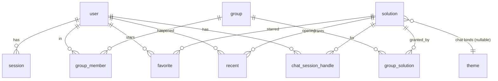

# Tech Plan — Data Model

Postgres + Drizzle. Two groups of tables: **better-auth-managed** (generated by its CLI) and **our domain** (referencing `user.id`). One deployment = one customer, so **no tenant/org column anywhere**.



## better-auth-managed (do not hand-write — generated, then committed)

`user`, `session`, `account`, `verification`. We extend `user` via `additionalFields` and the `admin` plugin:

- `user.name` → the editable **display name** (FR-ACCT-01).
- `user.role` → multi-value string (`"user"` / `"user,admin"`); `adminRoles: ["admin"]`.
- `user.banned` (admin plugin) → the **disabled** state.
- `user.status` (custom field) → **invite lifecycle only**: `'pending' | 'active'` (disabled is _not_ here — see below).
- `user.mustChangePassword` (custom field, bool) → set for the **bootstrap admin** (whose `ADMIN_PASSWORD` is operator-known); a post-sign-in guard forces a change before any workspace/admin access, cleared on success. (Invited users set their own password via the reset link, so they don't need it.)
- `session` (id, token, expiresAt, ipAddress, userAgent, userId) powers the **Devices & sessions** list directly.

### Person status — derived, not dual-written

The FR's tri-state (Active / Disabled / Pending) is **derived** from two independent fields — we never write a redundant "disabled" copy:

| FR status | Derivation                                                                                                                                                                                                                            |
| --------- | ------------------------------------------------------------------------------------------------------------------------------------------------------------------------------------------------------------------------------------- |
| Pending   | `status = 'pending'` — admin `createUser` **with a generated throwaway password** (so a credential `account` row exists), then better-auth's reset link is emailed as "set your password"; flips to `active` once the password is set |
| Disabled  | better-auth `banned = true` (via admin `banUser`) — the **only** disabled-enforcement field                                                                                                                                           |
| Active    | not `pending` and not `banned`                                                                                                                                                                                                        |

- The custom **`status` field carries invite lifecycle only (`pending | active`)** — never "disabled".
- All better-auth admin mutations (`createUser`, `banUser`/`unbanUser`, role-set, session-revoke) live behind **one domain service**, so enforcement (`banned`) and lifecycle (`status`) can't drift and raw calls aren't scattered through UI procedures.

## Our domain tables

```ts
// people ↔ groups (membership) and groups ↔ solutions (the ONLY access grant)
export const group = pgTable("group", {
  id: uuid("id").defaultRandom().primaryKey(),
  name: text("name").notNull(),
  description: text("description"),
  createdAt: timestamp("created_at").defaultNow().notNull(),
  updatedAt: timestamp("updated_at").defaultNow().notNull(),
});

export const groupMember = pgTable(
  "group_member",
  {
    groupId: uuid("group_id")
      .notNull()
      .references(() => group.id, { onDelete: "cascade" }),
    userId: text("user_id")
      .notNull()
      .references(() => user.id, { onDelete: "cascade" }),
  },
  (t) => [primaryKey({ columns: [t.groupId, t.userId] })],
);

export const solution = pgTable("solution", {
  id: uuid("id").defaultRandom().primaryKey(),
  name: text("name").notNull(),
  slug: text("slug").notNull().unique(), // derived from name at registration
  type: text("type", { enum: ["chat", "native", "embedded"] }).notNull(),
  status: text("status", { enum: ["ready", "draft", "maintenance", "down"] })
    .notNull()
    .default("draft"),
  description: text("description"),
  monogram: text("monogram"), // e.g. "PT"
  archived: boolean("archived").notNull().default(false),
  themeId: uuid("theme_id").references(() => theme.id), // chat-only, nullable
  config: jsonb("config").notNull().default({}), // type-specific, zod-validated (below)
  createdAt: timestamp("created_at").defaultNow().notNull(),
  updatedAt: timestamp("updated_at").defaultNow().notNull(),
});

export const groupSolution = pgTable(
  "group_solution",
  {
    // access grant
    groupId: uuid("group_id")
      .notNull()
      .references(() => group.id, { onDelete: "cascade" }),
    solutionId: uuid("solution_id")
      .notNull()
      .references(() => solution.id, { onDelete: "cascade" }),
  },
  (t) => [primaryKey({ columns: [t.groupId, t.solutionId] })],
);

export const theme = pgTable("theme", {
  // chat-only
  id: uuid("id").defaultRandom().primaryKey(),
  name: text("name").notNull(),
  config: jsonb("config").notNull().default({}), // header color, bubble color, radius, font, placeholder, customCss, preset
  createdAt: timestamp("created_at").defaultNow().notNull(),
  updatedAt: timestamp("updated_at").defaultNow().notNull(),
});

export const favorite = pgTable(
  "favorite",
  {
    userId: text("user_id")
      .notNull()
      .references(() => user.id, { onDelete: "cascade" }),
    solutionId: uuid("solution_id")
      .notNull()
      .references(() => solution.id, { onDelete: "cascade" }),
  },
  (t) => [primaryKey({ columns: [t.userId, t.solutionId] })],
);

export const recent = pgTable(
  "recent",
  {
    userId: text("user_id")
      .notNull()
      .references(() => user.id, { onDelete: "cascade" }),
    solutionId: uuid("solution_id")
      .notNull()
      .references(() => solution.id, { onDelete: "cascade" }),
    openedAt: timestamp("opened_at").defaultNow().notNull(),
  },
  (t) => [primaryKey({ columns: [t.userId, t.solutionId] })],
); // upsert openedAt; query top-6

export const chatSessionHandle = pgTable(
  "chat_session_handle",
  {
    userId: text("user_id")
      .notNull()
      .references(() => user.id, { onDelete: "cascade" }),
    solutionId: uuid("solution_id")
      .notNull()
      .references(() => solution.id, { onDelete: "cascade" }),
    externalSessionUuid: text("external_session_uuid"), // nullable — the Genie conversation id; null ⇒ next send starts a fresh conversation
    generation: integer("generation").notNull().default(0), // bumped by "New chat"; the chat route upserts the returned uuid only if generation is unchanged → guards the in-flight-stream race
    updatedAt: timestamp("updated_at").defaultNow().notNull(),
  },
  (t) => [primaryKey({ columns: [t.userId, t.solutionId] })],
);
```

## `solution.config` — zod-validated per type

One JSONB column, validated by a discriminated union at the tRPC boundary (no per-type tables — only three types):

| type       | config shape                                                                                                                                                                                                             |
| ---------- | ------------------------------------------------------------------------------------------------------------------------------------------------------------------------------------------------------------------------ |
| `chat`     | `{ botUuid: string; apiEndpoint: string (https, SSRF-guarded); welcomeMessage?: string; starterPrompts?: string[]; feedbackEnabled?: boolean }` — `botUuid` is the external bot id; `apiEndpoint` is the per-solution streaming URL (FR-ADM-S-03); `themeId` binds the theme |
| `embedded` | `{ iframeUrl: string (https) }` — _(FR lists welcome/starters/feedback as "configurable" for embedded too, but those don't render inside an iframe; foundation models only `iframeUrl`. Re-add if a real need appears.)_ |
| `native`   | `{}` — deferred; row hidden from registration + hub filters                                                                                                                                                              |

## Notes & invariants

- **Access = membership ∩ grant.** A user's reachable solutions = `solutions` joined through `group_solution` ← `group` ← `group_member` for that user, minus `archived`. This query backs the hub list and the `assertCanSee` / `assertCanRun` guards (the latter also requires `status = ready`).
- **Recents & Favorites filter by _current_ access, not just stored rows.** The Recent and Favorites lists join through the same granted + unarchived + customer-visible predicate, so a solution whose grant is revoked / archived / set to draft disappears immediately. The `favorite`/`recent` rows are a cache, not the access source.
- **Cascade deletes** keep grants consistent: removing a person (FR-ADM-P-06) or deleting a solution (FR-ADM-S-04) strips its `group_member` / `group_solution` rows automatically.
- **Recents cap (6):** keep one row per `(user, solution)` (upsert `openedAt`); query `ORDER BY opened_at DESC LIMIT 6`. No pruning job needed.
- **Themes are chat-only:** enforced at the tRPC boundary (`themeId` settable only when `type = 'chat'`), not by a DB constraint.
- **Slug** is derived from name at registration and unique; it's the `/s/[slug]` viewer key.
