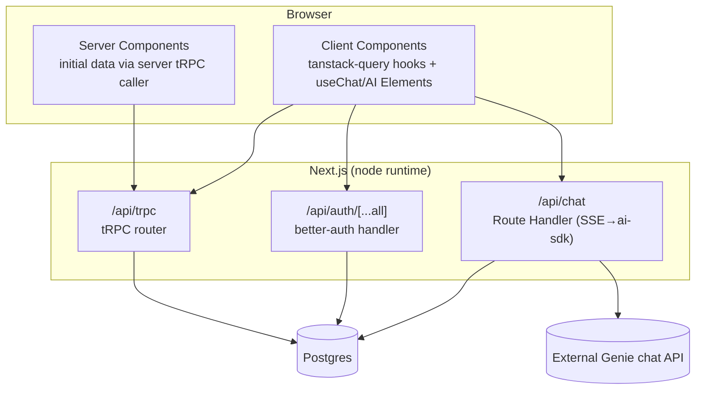

# Tech Plan — Platform Foundation

Architecture for the Genie Workspace foundation. Decisions here are settled; downstream implementation should not need to re-invent the governing mechanisms. Sub-artifacts: [Data Model](./data-model/index.md) · [Chat](./chat/index.md).

**Locked stack:** Next.js 16 (app router) · shadcn-on-baseUI · **ai-sdk-ui (`useChat`) + AI Elements (ported to Base UI)** for chat · Postgres + Drizzle + drizzle-kit · tRPC + `@trpc/tanstack-react-query` · zod · **better-auth** (identity/sessions). Single configurable Docker image, **one deployment per customer**.

## Architectural approach

- **Route groups:** `(auth)` (`/login`, `/admin/login`, `/forgot-password`, `/reset-password`, `/set-password`), `(workspace)` (`/`, `/recent`, `/favorites`, `/account`, `/s/[slug]`), `(admin)` (`/admin/...`). Feature-organized folders (per global CLAUDE.md: by feature, not file type).
- **Data flow:** RSC fetch initial data through a **server-side tRPC caller**; interactive mutations/queries through `@trpc/tanstack-react-query` hooks. Chat is the one exception — a streaming Route Handler.
- **Three API surfaces, one session:** better-auth's mounted handler owns auth; tRPC owns all CRUD; the chat Route Handler owns streaming. All three read the same better-auth session.
- **Client state & forms (conventions):** server/cache state via **tanstack-query** (+ `ReactQueryDevtools`, dev-only); complex client/UI state via **zustand** (stores wrapped in the `devtools` middleware in dev); forms via **react-hook-form + zod** (`@hookform/resolvers` `zodResolver`, reusing the shared zod schemas). Don't reach for zustand for trivial local state (`useState`) or for server data (tanstack-query owns that).

## Auth, session & authorization (the governing mechanism)

**better-auth** provides identity, credentials, sessions, password reset, and admin actions. We add the domain authorization (groups → solutions) on top.

### Roles — additive, not exclusive

| Role    | Holds                    | Grants                                                                   |
| ------- | ------------------------ | ------------------------------------------------------------------------ |
| `user`  | every account            | Sign in; workspace; solutions granted via their groups                   |
| `admin` | _added on top of_ `user` | Everything `user` has **plus** the Admin Portal and all admin operations |

- Stored as better-auth's multi-value `role` string: `"user"` or `"user,admin"`; config `adminRoles: ["admin"]`. UI label: **"Admin"**. _(Verified: better-auth admin plugin supports comma-separated multi-roles.)_
- An admin is a normal member too — matches the FR's "elevated member."

### The boundary is server-enforced, in three layers

| Layer                                | Job                                    | Note                                                                                        |
| ------------------------------------ | -------------------------------------- | ------------------------------------------------------------------------------------------- |
| Edge middleware                      | Coarse redirect if no session cookie   | **Not** an authz check — no DB at edge                                                      |
| Server layout (`(admin)/layout.tsx`) | Redirect non-admins away from `/admin` | UX guard                                                                                    |
| tRPC middleware                      | **The real guard**                     | `publicProcedure` → `protectedProcedure` (valid session) → `adminProcedure` (roles ∋ admin) |

- Authorization centralized behind **one guard** (`can(user, action)` / `assertAdmin(ctx)`) — never inline `role === 'admin'`. This seam lets a future ST-operator vs customer-admin split be a permission-set change, not a refactor. (Capability taxonomy deferred.)
- **"Separate admin sign-in" is UX routing only** — `/admin/login` routes admins to `/admin`, rejects non-admins. One session cookie.

### Two access guards — _see_ vs _run_ (was a single `assertCanOpen`)

Status must control **whether and how** a solution opens (FR-ADM-S-05), and the chat Route Handler — not just tRPC — is what calls the external API. So the guard splits:

| Guard                          | Check                                              | Allows                                                               |
| ------------------------------ | -------------------------------------------------- | -------------------------------------------------------------------- |
| `assertCanSee(user, solution)` | granted via the user's groups **and** not archived | Render the viewer shell + a `Maintenance`/`Down` status notice       |
| `assertCanRun(user, solution)` | `assertCanSee` **and** `status = ready`            | `/api/chat` streaming, live embedded iframe, (future native runtime) |

- Hub/catalogue query lists **granted + unarchived** solutions, surfaces `ready | maintenance | down`, and **hides `draft`** from customers. `Draft` is never openable.
- **Recents & Favorites** are gated by the _same_ access predicate (granted + unarchived + visible), not just the stored per-user rows — so revoking/archiving/drafting a solution drops it from those lists immediately. The `favorite`/`recent` rows are a cache, not the access source.
- Solution access itself = `solutionId ∈ (solutions granted to the user's groups)` (the union query). Used inside both guards.

### Sessions & lifecycle

- DB-backed sessions (better-auth `session` table) → revocable, enumerable. This is _why_ better-auth over JWTs.
- **Idle timeout (15 min):** `session: { expiresIn: 15m, updateAge: ~0 }` so the expiry slides forward on each authenticated request → the session dies 15 min after the _last activity_ (idle, not absolute). **Disable `cookieCache`** (or cap it well below 15 min) so requests hit the DB and refresh/revocation are exact. The 60s warning modal + "stay signed in" ping is client-side. **Verification gate:** a test that simulates activity-before-expiry (expiry extends) and idle-past-15m (rejected across tRPC, RSC, `/api/chat`).
- **Devices & sessions** (FR-ACCT-03) → `listSessions` / `revokeSession` / `revokeOtherSessions`. **Admin force-sign-out** (FR-ADM-P-05) → admin-plugin revoke-user-sessions.
- **Password reset / change** → `sendResetPassword` + `revokeSessionsOnPasswordReset: true`; strength ≥3 in a shared zod schema (UI meter + server).

### Person lifecycle — invite, disable, status (single source per state)

- **Invite / "pending"** (decided): admin `createUser` **with a generated throwaway password** (so a credential `account` exists), then email better-auth's reset link as the "set your password" message. Activation is explicit, not assumed:
  - **No separate email-verification step** in foundation — clicking the link and setting a password _is_ the verification.
  - better-auth's **`onPasswordReset` hook** (or the reset-callback route) flips `status` `pending → active` atomically, only for pending users.
  - A **sign-in guard rejects `status = 'pending'`** accounts except on the set-password path, so an un-activated invite can't get a workspace session.
  - **Fallback** (verify at impl): if better-auth's reset can't activate an admin-created unverified account, switch to a custom invite-token + admin `set-user-password` flow rather than discovering it mid-build.
- **Disabled** is enforced solely by better-auth `banUser`/`unbanUser` (`banned`). The custom **`status` field is invite-lifecycle only (`pending | active`)** — it does _not_ carry "disabled".
- **Forced password change:** a custom `user.mustChangePassword` flag (set for the bootstrap admin, since its `ADMIN_PASSWORD` is operator-known) — better-auth has no built-in flag for this.
- **Limited-session states are enforced server-side at one point, not by page redirects.** `pending` is blocked at better-auth's `session.create.before` hook (the same surface its banned-user check uses), except on the set-password path. `mustChangePassword` users may hold a session, but the **shared session accessor used by RSC, tRPC, and `/api/chat`** returns "password-change-required" and rejects every non-auth action until cleared. Acceptance tests hit RSC load, tRPC, and `/api/chat` **directly**, not just browser navigation.
- The FR tri-state is **derived**, not dual-written: `pending` ← `status`; `disabled` ← `banned`; `active` ← otherwise. All better-auth admin calls go behind **one domain service** so `banUser`/`createUser`/role-set aren't called raw from UI procedures.

## Chat (external SSE → ai-sdk-ui + AI Elements)

The most detailed mechanism — full spec in the **[Chat sub-artifact](./chat/index.md)**. In brief:

- `/api/chat` Route Handler proxies the external Genie SSE → an ai-sdk **UI message stream**: `answer` deltas → `text` parts; `reasoning` → `reasoning` parts (the thinking block); `completed` ends the stream + carries usage (the full `answer` is **not** re-emitted).
- Client is **ai-sdk-ui `useChat`** rendered with **AI Elements** components, **re-skinned to Ledger** (we own the copied components; swap any Radix primitive that collides with Base UI). The answer renders through **AI Elements `Response` / Streamdown** — raw-HTML rendering + sanitization are built in.
- **Conversation model** (decided): one persistent thread per `(user, solution)` via `chat_session_handle`; a **"New chat"** action clears the handle to start fresh. Resume = model-continuity, blank-but-continuable screen.
- Bot identity = `solution.config.botUuid` (server-side); external base/secret never reach the client; `assertCanRun` gates the route.

## Embedded solutions (iframe)

- Per-solution HTTPS `iframeUrl` (in `config`) in a `<iframe sandbox=...>`. CSP `frame-src` is an **allow-list from `ALLOWED_IFRAME_ORIGINS` env** — not `*`. Loading/error states; no SSO/token handoff in foundation. Gated by `assertCanRun`.

## Operational

- **Build:** Next.js `output: 'standalone'`, multi-stage Dockerfile. One image, configured per deployment by env.
- **Migrations — single owner:** the better-auth CLI **generates Drizzle schema source** for the auth tables (committed into our schema alongside domain tables); **drizzle-kit owns the only migration history** (`drizzle-kit generate`); the container entrypoint runs **`drizzle migrate` only**, under a Postgres advisory lock. **Never** run better-auth's own `migrate`.
- **First-admin bootstrap (guarded):** no public signup. On startup, **only if the `user` table is empty**, seed one `user,admin` from `ADMIN_EMAIL`/`ADMIN_PASSWORD` — but **validate the password against the same strength rule**, set **force-change-on-first-login**, and **log a one-time bootstrap event**. Deployment docs: clear `ADMIN_PASSWORD` after first boot.
- **Config/secrets (env):** `DATABASE_URL`, better-auth secret + base URL, `EXTERNAL_CHAT_API_BASE` (+ token if ever required), `ALLOWED_IFRAME_ORIGINS`, `ADMIN_EMAIL`/`ADMIN_PASSWORD`.

## Boundaries & non-goals

- No multi-tenant / org table (one deployment = one customer).
- Native solution runtime not built — `native` is an enum only, hidden from registration + catalogue, not openable/grantable.
- No chat transcript storage, no durable feedback, no SSO-to-embedded, no 2FA — all explicit later slices.

## Open items to confirm at implementation

- better-auth: that the reset-link path **activates** an admin-created (unverified) user with a generated password (the invite path) — else use the custom-token fallback; exact idle config values pass the timeout test.
- Chat (see sub-artifact): exact ai-sdk **reasoning** writer part types; external error-event shape; attachment upload contract.
- The per-component **Radix → Base UI** primitive swaps for the AI Elements being copied (enumerate when scoping chat tickets).
