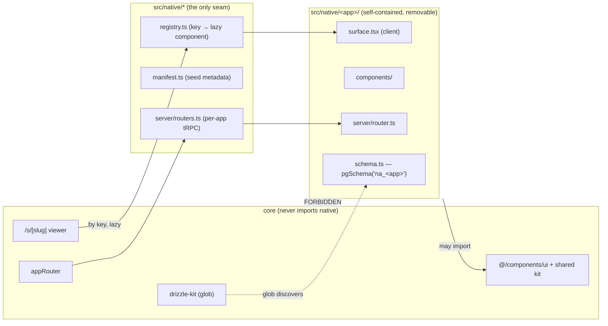
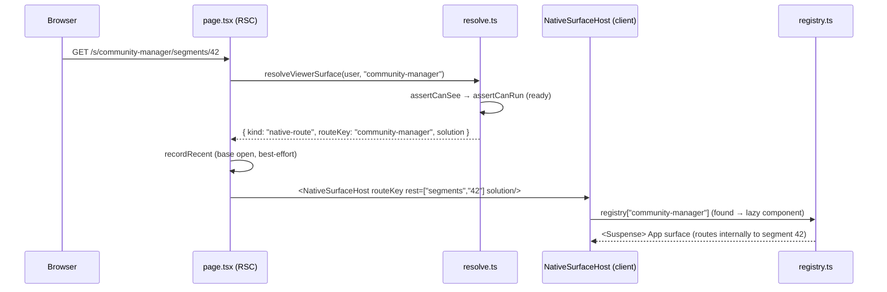

# Tech Plan — Native solutions foundation

> **Planned, not implemented:** no `src/native/`, sync script or native catch-all viewer exists yet. The procedures below describe the target architecture and cannot be run against the current repo. See the [planned native-app guide](../../native-apps/index.md) and Beads for status.

A **native solution** is a first-party app built inside this codebase (e.g. a future *Community Manager* or *News Verification*) that a customer opens through the normal solution viewer. This plan defines the runtime and — the load-bearing part — the **module boundary that makes every native app self-contained and cleanly removable**, including its database.

Governs **ticket 24**. **Depends on** [platform-identity](../platform-identity/index.md) (ticket 25) for the `Everyone` group used as the default grant target. Product decisions were owner-approved (2026-07-03).

## The load-bearing decision: a one-way module boundary

The reference implementation (`/home/kenan/work/geniecontrolstation`) smeared each app across `app/(dashboard)/*`, `components/*`, `app/api/*`, `hooks/*`, the shared `schema.ts`, and even let core import *from* an app (`applications` → `news-verification/section-nav`). Removing an app there means archaeology.

The invariant that prevents this:

> **Imports flow one way: `native → core/kit` only. Core code MUST NOT import from `src/native/`.** The only inbound references to a native app are three thin barrels that reference apps *by key / lazy import* — never a hard type/value import into core.



Because the barrels reference apps by key or lazy `import()`, deleting an app directory can never strand a hard import in core — the type system points you at the one barrel line to remove, and nothing else breaks.

## Module anatomy — `src/native/<app>/`

Each native app is one directory:

```
src/native/
  registry.ts          # CLIENT: { [key]: { component: lazy(() => import("./<app>/surface")) } }
  manifest.ts          # ISOMORPHIC (plain data): [{ key, slug, name, monogram, status }] — sync seed source
  server/routers.ts    # merges per-app routers under ONE `native` tRPC key
  <app>/
    surface.tsx        # "use client" entry the registry lazy-loads; owns internal routing
    components/        # app-only UI (may import @/components/ui + shared kit)
    server/router.ts   # app's own tRPC router (client surface → server data)
    schema.ts          # app's OWN tables in pgSchema("na_<app>")  (only if it needs a DB)
```

Two files are deliberately split so the seam works across the client/server/Node boundaries:

- **`registry.ts`** is a client module (holds `React.lazy` component refs). Imported by the viewer's client host.
- **`manifest.ts`** is plain isomorphic data (no React) so the Node **sync script** can import it without pulling a `"use client"` graph into Node.

Rationale for **client-only lazy components** (owner pick): native surfaces are `"use client"` and fetch through their own tRPC router. Simpler mental model than server components; consistent with how `ChatSlot`/`EmbeddedView` already work. Trade-off accepted: a native surface can't server-render data — it fetches on the client after hydration.

## Database isolation — the removability requirement

**Each app's tables live in a dedicated Postgres schema** (`pgSchema("na_<app>")`) declared in the app's own `schema.ts`. This is the mechanism that makes data "clearly separated from core and easily removed."

- `drizzle.config.ts` changes its single `schema: "./src/server/db/schema.ts"` (drizzle.config.ts:8) to a **glob array**: `["./src/server/db/schema.ts", "./src/native/**/schema.ts"]`. App schemas are then auto-discovered — **adding or removing an app dir needs no core edit** for generation.
- Native routers query their tables via **direct table refs** on the shared `db` connection (`src/server/db/index.ts:17`). Drizzle's `db.select().from(nativeTable)` does not require the table to be in the client's `{ schema }` object, so `db/index.ts` and the better-auth adapter never touch native tables — isolation preserved on the read path too.
- **Removal** = delete the app's `schema.ts` → `pnpm db:generate` emits the drop → run migrate → the app's tables and data are gone via `DROP … CASCADE`; the core `public` schema is untouched.

Migrations stay **one linear history** owned by drizzle-kit (`drizzle/`, applied by the advisory-locked entrypoint `src/server/entrypoint.ts:91`). A removed app leaves its create-migration in history plus a new drop-migration — normal and harmless.

| Alternative | Why not |
| --- | --- |
| Separate database/connection per app | Real isolation, but multi-connection ops burden, no cross-schema transactions, migration streams multiply — overkill for a few tables. |
| Single shared `schema.ts` with name prefixes | What the reference did — tables and migration history intermix with core; not actually separated. |

## Viewer wiring & routing

Native apps are **URL-addressable** (owner pick): the viewer route becomes an optional catch-all so an app owns sub-routes and deep links.

- **Route:** `src/app/(workspace)/s/[slug]/page.tsx` → `s/[slug]/[[...rest]]/page.tsx`. The `slug` still drives the single access gate; `rest` is passed to the surface for client-side internal routing.
- **Resolver:** `src/features/solution-viewer/server/resolve.ts` gains a union member `{ kind: "native-route"; routeKey: string; solution: ViewerSolutionMeta }`. The current native branch (resolve.ts:115-116, returns `not-openable`) is replaced with: after `assertCanRun` (status must be `ready`), parse `nativeConfig`, return `native-route`. So native inherits the exact see/run lifecycle — draft → 404, maintenance/down → status notice (already handled before the native branch, resolve.ts:108), archived/no-grant → 404/403.
- **Render:** the page's `native-route` branch renders a client `<NativeSurfaceHost routeKey rest solution />` that does the `registry` lookup and renders the lazy component in `<Suspense>`. **Unknown `routeKey` → `<NotOpenableNotice />`** (no crash, no leak — access already passed).
- **Recents:** `recordRecent` (page.tsx:50) fires once on the **base** open, not per internal sub-path.
- **Two chrome consumers must become sub-path-aware (critique finding 5)** — the catch-all makes `pathname` change on internal native navigation, which today breaks:
  - `pinned-favorites.tsx:95` — `active = pathname === /s/${slug}` (exact) → won't highlight inside a sub-route. Fix: `pathname === /s/${slug} || pathname.startsWith(/s/${slug}/)`.
  - `workspace-chrome.tsx:50-53` — a `useEffect` keyed on `[pathname]` closes the drawer + resets `sidebarHidden` on *every* pathname change, so a native app's chrome state is wiped on each internal nav. Fix: key the reset on a derived **route root** (collapse `/s/<slug>/… → /s/<slug>`), so it fires only when the app/page changes, not on internal sub-navigation.
  - `workspace-header.tsx:20` already uses `startsWith("/s/")` — unaffected.

Request trace for a granted, ready native solution at `/s/community-manager/segments/42`:



## Registration & the sync script

A native app needs a `solution` row (type `native`, `config.routeKey = <key>`) to be reachable. `scripts/sync-native-solutions.ts` (mirrors the idempotent select-by-slug + upsert pattern of `scripts/seed-demo-solutions.ts`):

- Reads **`src/native/manifest.ts`** — so removing an app's manifest line removes it from sync automatically.
- Upserts each native `solution` row (slug/name/monogram/status/`config.routeKey`), idempotent by the unique `slug`.
- **On first creation of a row**, grants it to the `Everyone` group (from ticket 25). The grant is *not* re-asserted on later runs — admins can revoke the Everyone grant and grant specific groups instead via the Access UI, and sync won't re-add it (membership is locked; grants stay editable).
- **Declarative reconcile (critique finding 6):** the manifest is authoritative. A native `solution` row whose `routeKey` is **no longer in the manifest** is **archived** (`archived = true`) — not hard-deleted — so removal is deterministic (archived rows drop from hub + viewer via the existing `customerVisible` filter) and reversible, with no `group_solution`/`favorite`/`recent` cascade. The app's real data is already gone via `DROP SCHEMA`; the core metadata row is safely parked and logged for optional manual hard-delete. (Chosen over hard-delete-and-cascade for safety/reversibility.)
- **Drift guard (warn, don't fail):** a manifest key with no registry entry, a registry key with no manifest entry, or a DB `native` row whose `routeKey` isn't in the registry — so a deployed row never silently hits `not-openable`.

## Hub, recents & favorites

Native participates identically to chat/embedded once one line is removed — no per-type code.

- Delete `sql\`${solution.type} <> 'native'\`` from `customerVisible` (`src/features/solutions-hub/server/queries.ts:61`). That predicate is the single shared gate for hub + recents + favorites, so native rows immediately flow into all three (starrable, recorded on open, in the recent rail / Favorites).
- Widen `HubTypeFilter` (queries.ts:87) to include `"native"` and add the `{ value: "native", label: "Native" }` chip to `TYPE_FILTERS` (`solutions-hub/components/solutions-hub.tsx:34`). Type rendering already uses the function `typeLabel` (`solution-row.tsx:23` → `"NATIVE"`), so no missing-key crash.
- **Admin Solutions directory — native shown read-only/locked** (owner pick; critique finding 3). Native rows *stay* in `solutions.list` (`src/features/solutions/server/router.ts:181`) and render in the admin directory as locked, **code-owned** rows. A hidden button is not a barrier (same bypass class as finding 1), so every *mutating* solutions procedure **rejects `type === "native"` server-side** — `update`, `duplicate` (`:339`, which today clones `type`+`config` verbatim and would otherwise mint a native solution), `setStatus`, and `remove`/archive. Add the `native` key to `TYPE_LABEL` / `TYPE_LABEL_UPPER` (`solutions-directory.tsx` — currently missing → `undefined`) plus a "code-owned" lock affordance on the row. The register dialog stays `chat | embedded` (unchanged). Native still appears — and is grantable/revocable — on the **Access** screen (`SOLUTION_TYPE_LABEL` there already includes native), which is a *different* list from the directory.
- Fix the now-stale comment at `src/server/features/solution-access.ts:74-82` ("native is never granted, so it can't reach recents/favorites anyway") — false once native is granted.

## Schema & access

- `nativeConfigSchema` (`src/features/solutions/schemas/solution.ts:74`): `z.object({}).strict()` → `z.object({ routeKey: z.string().min(1) }).strict()`. `configByTypeSchema` (:83) picks it up. RouteKey is a free string at the schema layer (the schema is client-imported and can't see the server registry); registry validation happens at render + in the sync drift guard.
- `solutionTypeSchema` stays `["chat", "embedded"]` (:24) — no admin creation. The DB `type` enum already includes `native` (schema.ts:63) — **no migration for the enum**.
- Access is unchanged: `assertCanSee`/`assertCanRun` (`solution-access.ts`) already native-agnostic. Permissions = group grants, same union query. No new access code.

## Example surface (ships with the foundation)

A minimal `src/native/example/` that exercises the whole stack end-to-end — a `surface.tsx` mounted via the catch-all, one table in `pgSchema("na_example")`, a per-app router reading it, a manifest entry seeded + granted to Everyone, and a clean `DROP SCHEMA na_example CASCADE` on removal. It proves the *isolation pattern*, not a product. The real apps (Community Manager, News Verification) land later as their own work, dropped into this shape.

## Removal recipe (the acceptance test for the design)

1. `rm -rf src/native/<app>/`
2. Delete the app's one line in `registry.ts`, `manifest.ts`, and `server/routers.ts`.
3. `pnpm db:generate` → drizzle emits `DROP TABLE … CASCADE` per table + a `DROP SCHEMA na_<app>` (note: the schema drop is **not** CASCADE — any non-Drizzle-managed object under it, e.g. a hand-created view/sequence, must be cleaned up first); commit the migration.
4. Re-run `sync-native-solutions.ts` → the manifest no longer lists the app, so its `solution` row is **archived** by the declarative reconcile (above); grants/favorites/recents stay inert behind the archived filter. Hard-delete the parked row manually only if you want it fully gone.
5. `tsc` proves nothing in core referenced it (the one-way invariant guarantees the only breaks are the barrel lines already removed).

## Constraints & failure handling

- **One-way imports** (enforced by review + the barrel structure; add an **oxlint** `no-restricted-imports` rule — the repo uses oxlint, not ESLint — forbidding `@/native/*` from outside `src/native/`).
- **Schema-glob is build-time-coupled, not runtime (critique finding 4):** `db:generate` compiles every `src/native/**/schema.ts` together, so a malformed app schema fails generation for the whole app — but that's a **loud, pre-deploy** failure, never a runtime break. Guard it with a CI/pre-commit step (`tsc` over the native schemas + a `db:generate` check) so a broken schema is caught in the PR that adds it. Isolation here is a runtime + removability property, not a compile-time one.
- **Unknown/unregistered `routeKey`** → `not-openable` notice, never a crash or stack trace.
- **Missing Everyone group** (ticket 25 not yet applied) → sync's grant step is a no-op with a warning; native rows exist but reach only explicitly-granted groups.
- **One URL shape, one access gate** — no `/native/*` tree with its own auth; everything rides `/s/[slug]/…`.

## Open items (implementation judgment, not blocking)

- Deep-link hydration UX for client surfaces (loading state before the internal route resolves).
- Exact drift-guard warning format and whether sync should hard-fail in CI vs warn in dev.
