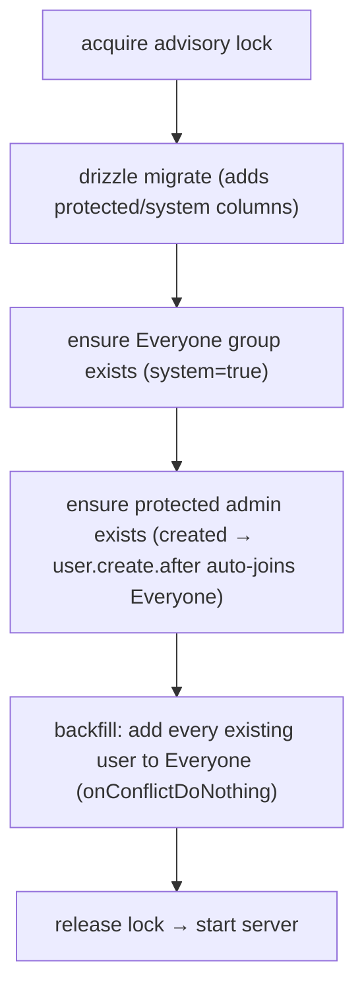

# Tech Plan — Platform identity invariants

Two system-managed invariants the platform must always hold, independent of any feature:

1. **A protected admin account** that always exists and can't be locked out.
2. **An `Everyone` group** that provably contains every user at all times.

Governs a new **ticket 25**, a prerequisite for [native-solutions](../native-solutions/index.md) (ticket 24), which uses `Everyone` as the default grant target. Both are net-new: today there is **zero** protection — any admin can delete/ban/demote any admin (including themselves), any group is deletable, group membership is a whole-set diff that can drop anyone, and new users join zero groups.

## Current state (grounded)

- Admin = the string `"admin"` inside the multi-value `user.role` (`src/server/db/auth-schema.ts:15`; parsed in `src/server/authz.ts:98-103`). No `isAdmin`/`protected` column.
- Bootstrap admin (`src/server/bootstrap.ts:20-53`) seeds from `ADMIN_EMAIL`/`ADMIN_PASSWORD` **only if the user table is empty** (guard keys on "any user exists", :28-31), runs every boot in the advisory-locked entrypoint (`src/server/entrypoint.ts:92-93`).
- `users` mutations (`src/features/users/server/router.ts`) — `remove` (:92), `disable`/ban (:56), `update`→role demote (:42-54) — are `adminProcedure` but have **no self-protection or last-admin guard**.
- `group` (`schema.ts:33-39`) has no `system`/`kind`/`slug` flag. `deleteGroup` (`group-service.ts:137`) deletes any group; membership is a whole-set diff via `setMembers` (`group-service.ts:144-167`) that removes anyone omitted.
- The only user-creation paths are bootstrap + invite, both via `auth.api.createUser`; there is **no `databaseHooks.user.create` hook** yet (`auth.ts:117-155`).

## Invariant A — protected admin account

One **designated** protected account (the bootstrap admin); other admins stay normal. **Lock scope:** cannot be **deleted, banned, or demoted** (admin access can never be locked out); **email / name / password stay fully editable** like any admin.

- **Marker & identity anchor:** add `protected boolean default false` to `user` (better-auth `additionalFields`, `input: false` like `status`; migration). Identity is anchored on **this flag, not the email** — `ADMIN_EMAIL` is only the *first-boot seed value*. This is what lets the admin freely change its email without ever minting a duplicate (resolves critique finding 2).
- **Ensure-exists (keys on the flag):** on boot, "if **no `protected = true` user exists**, create one from `ADMIN_EMAIL` and flag it; otherwise no-op." Because existence is measured by the flag (not the address), changing the email later — or a different `ADMIN_EMAIL` env on a later deploy — never creates a second protected admin.
- **Enforcement at the better-auth layer (closes the bypass — critique finding 1):** tRPC `users` guards are **not** a sufficient barrier. The `admin` plugin independently exposes `/api/auth/admin/{set-role,ban-user,remove-user}` over HTTP (`app/api/auth/[...all]` mounts the full handler via `toNextJsHandler`), authorized only on the *caller's* role — any second admin can `curl` past a tRPC guard. Both the HTTP endpoints and the tRPC path flow through `internalAdapter.updateUser`/`deleteUser` (`better-auth/db/internal-adapter.mjs:507,157`), which fire `databaseHooks.user.update.before` / `user.delete.before` (`db/with-hooks.mjs:47,126`). So enforcement lives in those **two DB hooks** — the single point every path crosses:
  - `user.delete.before` → reject when the target is `protected` (un-deletable).
  - `user.update.before` → **field-aware**: reject only when the change sets `banned = true` or drops `admin` from `role` on a `protected` user; **allow** email / name / other edits. (Resolve the target row to read `protected`.)
  - Belt-and-suspenders: if the `update.before` hook can't cleanly resolve the target id, add an endpoint-level `hooks.before` matcher on the three `/admin/*` paths (they see `body.userId`).
- Fails closed with a clear error on a rejected mutation.

## Invariant B — Everyone group (materialized, system-managed)

Access is `membership ∩ grant` through `groupMember`, so the cleanest design is a **materialized** group with real member rows — **no access-query change at all**; `Everyone` is just a group that always contains everyone, and grants to it work like any other group (this is how native gets its default reach).

- **Marker:** add `system boolean default false` to `group` (migration). Exactly one `system` group named `Everyone`.
- **Auto-join (new users):** add a `databaseHooks.user.create.after` in `src/server/auth.ts` — the *single* seam that catches both bootstrap and invite (both go through `auth.api.createUser`). It inserts the `Everyone` membership (`onConflictDoNothing`).
- **Seed + backfill (existing users):** in the entrypoint, ensure the `Everyone` group exists **before** the bootstrap admin is created, then backfill every existing user as a member — idempotent, under the same advisory lock.
- **Locks:**
  - `setMembers` (`group-service.ts:144`) → reject/ignore membership edits when the target group is `system` (the transfer-list can't drop anyone). The UI shows Everyone as all-users, read-only.
  - `deleteGroup` (`group-service.ts:137`) and rename → reject for a `system` group.
- **Still grantable:** only *membership* and *existence* are locked. Admins can grant/revoke solutions to `Everyone` normally (`setSolutions`), so native visibility stays per-group controllable.

## Data-model changes

| Table | Column | Purpose |
| --- | --- | --- |
| `user` | `protected boolean default false` | marks the un-deletable/-bannable/-demotable admin |
| `group` | `system boolean default false` | marks the `Everyone` group (locked membership/existence) |

One additive migration (a `drizzle-kit generate`); no data backfill in SQL — the row/membership seeding is the entrypoint's job so it also covers auto-join going forward.

## Enforcement seams

| Seam | File | Change |
| --- | --- | --- |
| New-user auto-join | `src/server/auth.ts:117` (`databaseHooks`) | add `user.create.after` → insert Everyone membership |
| Boot seed (rewrite) | `src/server/entrypoint.ts:79-95`, `src/server/bootstrap.ts` | replace `bootstrapAdmin`'s single `if (existing) return` gate with `ensureSystemInvariants()` — three independent idempotent ensures (Everyone group → protected admin → Everyone backfill) |
| Protected-admin enforcement | `src/server/auth.ts` — `databaseHooks.user.update.before` + `user.delete.before` (+ optional endpoint `hooks.before` on `/admin/*`) | reject delete/ban/demote of a `protected` user on **every** path (tRPC + direct `/api/auth/admin/*`); field-aware so email/name edits pass |
| Everyone membership lock | `src/features/groups/server/group-service.ts:144` (`setMembers`) | ignore/reject edits when `group.system` |
| Everyone existence lock | `group-service.ts:137` (`deleteGroup`) + rename | reject when `group.system` |

## Entrypoint sequence (order matters)

Everyone must exist **before** any user is created so the `user.create.after` hook can add membership; the backfill then sweeps up pre-existing users idempotently.

**Bootstrap rewrite (critique finding 7):** today `bootstrapAdmin` returns early if *any* user exists (`bootstrap.ts:28-31`), so the group-seed can't be dropped in beside it — it would be skipped on every boot after the first user. Replace that single gate with **`ensureSystemInvariants()`**: three independently idempotent steps (not one all-or-nothing return), each safe to re-run every boot. `ensureProtectedAdmin()` no longer keys on "table empty" — it keys on "no `protected` user exists" (Invariant A).

## Failure handling

- **Hook fails / partial state:** the per-boot backfill is the safety net — it re-adds any user missing from Everyone, so drift self-heals on the next deploy.
- **Someone removed a member via a pre-guard path / old data:** backfill restores it.
- **Protected flag lost (legacy row / manual DB edit):** ensure-exists finds no `protected` user and re-seeds/re-flags the `ADMIN_EMAIL` account on boot — a recovery path only; normal operation never loses it.
- **Fails closed:** guards reject the mutation rather than silently allowing a lockout.

## Interaction with native solutions (ticket 24)

`sync-native-solutions.ts` grants native rows to the `Everyone` group on first creation. If ticket 25 isn't applied yet, that grant step no-ops with a warning and native reaches only explicitly-granted groups — native still functions, just without default-everyone reach.
