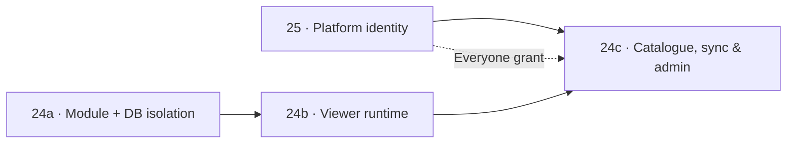

# 24 · Native solutions foundation

Gives `native` a real runtime: each native solution is a first-party in-app application, **self-contained and cleanly removable** (code *and* its own isolated database), surfaced through the existing `/s/[slug]` viewer. Resolves the ticket-11 / FR-HUB-03 "Native" gap.

Governs: [tech-plan/native-solutions](../../tech-plan/native-solutions/index.md). Contributor how-to: [native-apps guide](../../native-apps/index.md).

> Refreshed 2026-07-03 (critique finding 9): the earlier single-file `native-registry.ts` sketch is superseded by the `src/native/` removable-module architecture in the tech-plan. This is now a story split into three sequential tickets.

## Sub-tickets

- [24a · Native module system + DB isolation](./24a-module-db-isolation/index.md) — the `src/native/` module boundary, barrels, per-app `pgSchema`, drizzle glob, example app scaffolding. *(No user-facing change.)*
- [24b · Native viewer runtime](./24b-viewer-runtime/index.md) — schema `routeKey`, `native-route` resolver, catch-all route + `NativeSurfaceHost`, catch-all consumer fixes.
- [24c · Native catalogue, sync & admin surface](./24c-catalogue-sync-admin/index.md) — un-hide + hub filter, sync script (archive reconcile + Everyone grant), admin read-only native.

## Dependency view

## Depends on

- [25 · Platform identity](../25-platform-identity/index.md) (Everyone group — 24c grants native to it).
- [11 · Solutions hub](../11-solutions-hub/index.md), [12 · Viewer shell + status + embedded](../12-solution-viewer-embedded/index.md) (the surfaces this extends).

## Non-goals (unchanged)

- No admin creation of native (register stays `chat | embedded`); no arbitrary admin-authored routes; no per-native theming.
