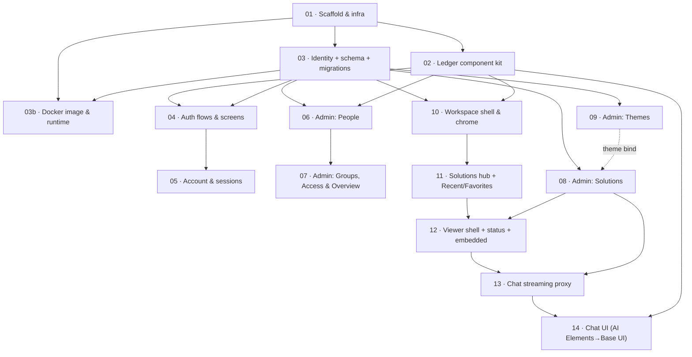

# Platform Foundation — Implementation Tickets

Sequenced breakdown of the [tech plan](../tech-plan/index.md) ([data model](../tech-plan/data-model/index.md) · [chat](../tech-plan/chat/index.md)). Coarse, story-sized; each leaves the codebase working. Critique invariants ride as acceptance criteria on the relevant tickets.

## Dependency view

## Phases & tickets

**Phase 1 — Identity & foundation**
1. [Scaffold & infra](./01-scaffold-infra/index.md) — Next.js 16, shadcn-on-baseUI + Tailwind + Ledger tokens, tRPC + tanstack-query, Drizzle client + drizzle-kit, oxlint/oxfmt + pre-commit hook, git remote, route groups.
2. [Ledger component kit](./02-ledger-component-kit/index.md) — reusable Ledger-styled primitives (buttons, inputs, badge, toggle, segmented, tabs, table, dialog/confirm, slide-over, toast, empty, skeleton, dual-list).
3. [Identity + schema + migrations](./03-identity-schema-migrations/index.md) — better-auth config, full Drizzle schema, single migration history, tRPC procedures + guards, session-state enforcement, guarded bootstrap admin.
3b. [Docker image & runtime config](./03b-docker-runtime/index.md) — multi-stage Dockerfile, migrate + bootstrap entrypoint under advisory lock, zod-validated env, local compose, healthcheck. *(Runs parallel with 04/05.)*
4. [Auth flows & screens](./04-auth-flows-screens/index.md) — sign-in, admin sign-in, forgot/reset, set-password (invite activation), change password, idle-timeout modal.
5. [Account & sessions](./05-account-sessions/index.md) — profile, change password, devices & sessions.

**Phase 2 — Group-based access & admin console**
6. [Admin: People](./06-admin-people/index.md) — directory, invite, edit, lifecycle, account-security actions, remove, jump-to-group.
7. [Admin: Groups, Access & Overview](./07-admin-groups-access/index.md) — group CRUD, inspector, dual-list transfers, access-overview explorer.
8. [Admin: Solutions](./08-admin-solutions/index.md) — table + status, register, configure (botUuid/iframeUrl/theme bind), row actions.
9. [Admin: Themes](./09-admin-themes/index.md) — theme CRUD, editor, device preview (chat-only).

**Phase 3 — Customer workspace**
10. [Workspace shell & chrome](./10-workspace-shell/index.md) — responsive layout/sidebar/drawer, nav, presentation modes, offline indicator, **server auth gate**.
10b. [Access-path indexes](./10b-access-indexes/index.md) — inverse-direction indexes for the access/recents predicates. *(Land before 06–10 add data volume.)*
11. [Solutions hub + Recent/Favorites](./11-solutions-hub/index.md) — access-gated catalogue, search/filter/sort/progressive-load, favorites, recent/favorites views.
12. [Viewer shell + status + embedded](./12-solution-viewer-embedded/index.md) — `/s/[slug]`, see/run gating, status notices, embedded iframe (sandbox/CSP), recents recording.

**Phase 4 — Chat viewer**
13. [Chat streaming proxy](./13-chat-proxy/index.md) — `/api/chat` SSE→ai-sdk stream, generation-guarded handle + send lease, reasoning/text parts, New chat.
14. [Chat UI (AI Elements → Base UI)](./14-chat-ui/index.md) — useChat + AI Elements ported to Base UI + Ledger, Streamdown hardening, reasoning block, starters, feedback.

**Rework backlog (15–23):** [design-conformance + Phase-3 review rework](./rework-backlog/index.md) — admin shell, kit fixes, correctness, and per-screen drift, sequenced into three waves.

**Phase 5 — Native solutions & platform identity**

25. [Platform identity invariants](./25-platform-identity/index.md) — protected admin (un-deletable/-bannable/-demotable, editable email) + always-all-users Everyone group. **Prerequisite for native.**
24. [Native solutions foundation](./24-native-solutions-foundation/index.md) — self-contained, removable in-app modules (own `pgSchema`), viewer runtime, sync + catalogue. Resolves ticket 11's Native gap. Split into [24a · module + DB isolation](./24-native-solutions-foundation/24a-module-db-isolation/index.md) → [24b · viewer runtime](./24-native-solutions-foundation/24b-viewer-runtime/index.md) → [24c · catalogue, sync & admin](./24-native-solutions-foundation/24c-catalogue-sync-admin/index.md). Depends on 25.

**Deferred (not ticketed):** 2FA/MFA, chat transcript persistence, durable feedback, SSO-to-embedded, attachments. *(Native solution runtime was deferred; ticket 24 delivers it.)*
