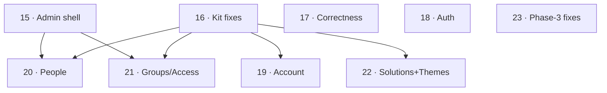

# Rework backlog

> **Archived backlog snapshot:** these entries are historical design-review notes. Beads is the current backlog and status source; this document is not a second active tracker.

Two sources, sequenced together: the **Design Conformance Audit** (historical source, not present in this checkout) (Phase 1/2 screen drift + kit + correctness) and the **Phase-3 review** (shell/hub/viewer, 2024-scope). Coarse, story-sized; each leaves the tree green.

> **Format note:** kept as one backlog file to stay lean; each ticket below is expanded into its own `tickets/<n>/index.md` when it's picked up for `/traycer-execute`. Numbering continues from the existing 01–14.

## Tickets

### From the Design Conformance Audit

- **15 · Admin shell** — the admin sidebar/nav/user-footer/route-aware header/mobile drawer (audit §B admin; currently a top-bar only). *(Workspace shell already shipped as ticket 10.)* Deps: —.
- **16 · Ledger kit fixes** — K1 Textarea `font-sans`; K2 TransferList row anatomy (checkbox/mono-tile/count-header/bulk-footer); K3 Select focus outline; K4 Toast default tone; K5 lighter slide-over scrim; K6 38px confirm buttons. Fix-once, propagates. Deps: —.
- **17 · Correctness-adjacent** — password-strength → 4-check/4-bar model (match prototype + ticket-04 spec); disabled status → neutral/no-dot (not error). Deps: —.
- **18 · Auth screens rework** — shared auth chrome (G-tile + footer), login/admin-login copy & IA, forgot-password status card, card-head typography (audit §C auth). Deps: —.
- **19 · Account rework** — profile-header + left sub-nav + single active panel, identity banner, "FULL NAME"/read-only email, panel titles (audit §C account). Deps: 16.
- **20 · People rework** — "HOW ACCESS WORKS" callout + `ALL PEOPLE` toolbar, invite→slide-over, edit slide-over restructure, table cols + initials tile, title scale (audit §C people). Deps: 15, 16.
- **21 · Groups/Access rework** — group edit→right-edge inspector, grants→dedicated Access screen, access-overview→focused explorer, directory callout + cols (audit §C groups). Deps: 15, 16 (needs K2 TransferList).
- **22 · Solutions + Themes rework** — Solutions: register→name/type/desc only, Configure live-preview + starter-prompts (+ endpoint field, **done** in H1), 4-col icon-action table; Themes: builder-forward IA, segmented tabs, curated swatches/segments, live-preview framing (audit §C solutions + themes). Deps: 16.

### From the Phase-3 review

- **23 · Phase-3 review fixes (shell / hub / viewer)** — Deps: 16 (soft).
  - **Shell:** hamburger has inline `display` so the hide-on-desktop media query can't win → make it class/breakpoint-driven (P1). Evaluate the Next-16 `middleware`→`proxy` deprecation (warning, not a break).
  - **Hub:** single-source native exclusion in `canSee` (remove the duplicated `<> 'native'` in the hub SQL — the invariant is one predicate); refresh the server-rendered PINNED rail after a favorite toggle (currently stale until navigation); reconcile sort/`UPDATED` semantics with the prototype; side-rail timestamp.
  - **Viewer:** move the viewer controls (`← Hub`, title, `▤`, `⤢`) into the 54px route-aware header per the prototype (currently a second in-page toolbar); add the Down-status "View status page ↗" link; seed down/draft demo variants (or fix the seed comment). *(The sandbox popup-escape and URL-parse findings are fixed in `f5ccd90`; iframe embedding now intentionally permits public HTTPS apps.)*

## Dependency view & schedule

- **Wave 1 (parallel, no cross-deps):** 15, 16, 17, 18, 23 — foundation (shell + kit) + independent fixes.
- **Wave 2:** 19 (needs kit).
- **Wave 3:** 20, 21, 22 (need shell + kit).

All are rework of shipped code except 15 (admin shell = new build). Every ticket must build against the prototype (`docs/design-package/Genie Control Station.dc.html`) per AGENTS.md.

## Audit (2026-07-02)

Tickets **15–22:** fully shipped (Waves 1–3 merged to `main` and reviewed).

Ticket **23 (Phase-3 fixes):** shipped — `status: 2`.

- **DONE:** hamburger CSS now class/media-query owned (`workspace-header.tsx:44-63`); native exclusion single-sourced in `customerVisible` (`queries.ts:53-58`), intentionally NOT duplicated in `canSee` (`solution-access.ts:69-86`) so direct native visits still reach NotOpenable; favorite toggle invalidates lists + `router.refresh()` for the server-rendered PINNED rail (`hub.ts:36-48`).
- **OPEN → RESOLVED (2026-07-02):** Down-status "View status page ↗" external link added (`status-notice.tsx`, brand CTA to `https://status.genie.ai`, down-branch only); recent-rail now shows last-opened timestamp via shared `relativeTime` (`solutions-hub.tsx` RecentRailRow). Seeded down/draft demo variants were a false positive — `scripts/seed-demo-solutions.ts` already seeds ready/maintenance/down/draft. The viewer-toolbar-in-header item stays a deliberate divergence.
- **Ticket 23 → status 2 (complete).**
